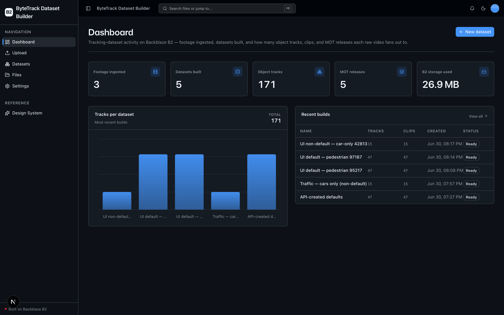
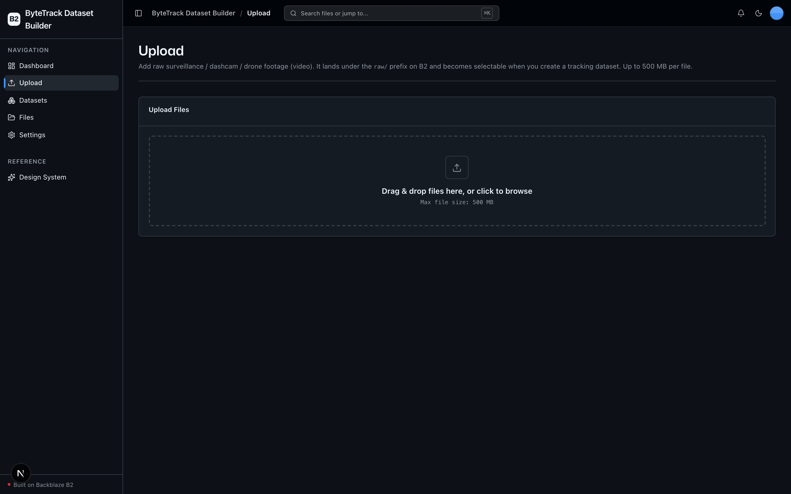
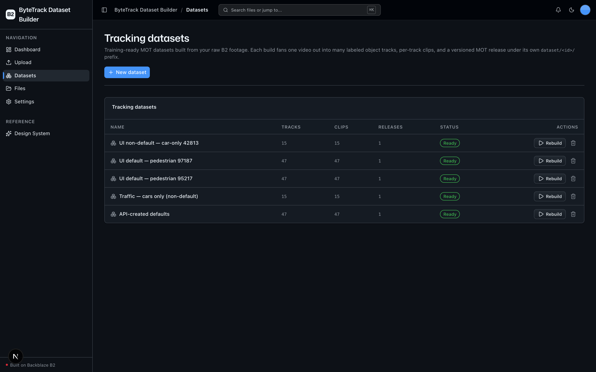
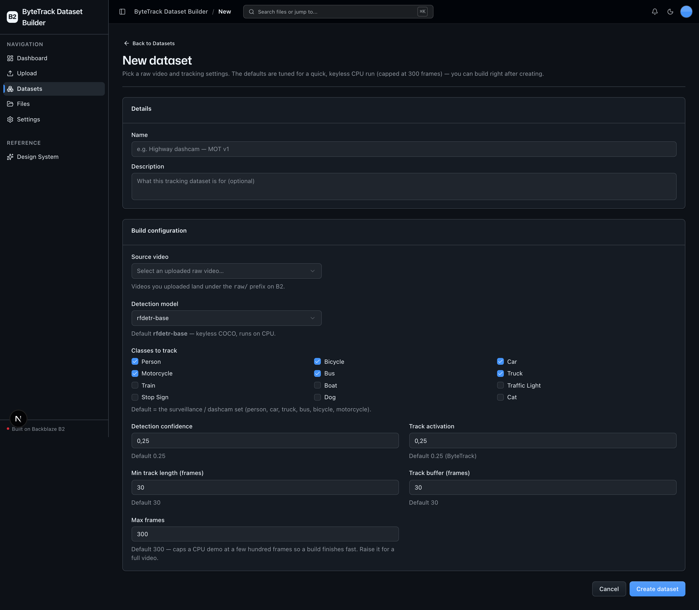
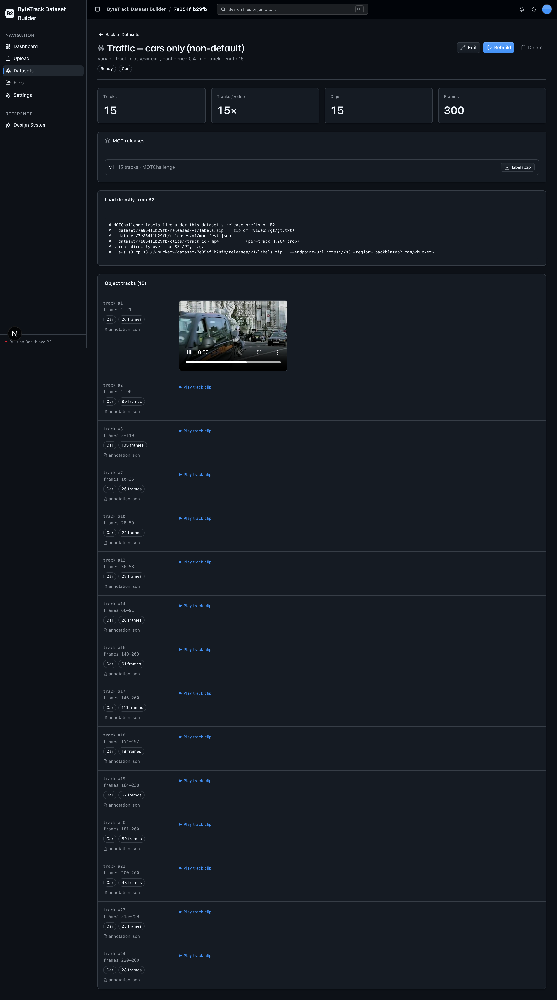

<!-- last_verified: 2026-06-30 -->
# ByteTrack Dataset Builder

Turn raw video stored on **[Backblaze B2](https://www.backblaze.com/sign-up/ai-cloud-storage?utm_source=github&utm_medium=referral&utm_campaign=ai_artifacts&utm_content=b2ai-bytetrack-dataset-builder)** into a **training-ready multi-object-tracking dataset** — per-track annotation JSON, a cropped clip per tracked object, and a versioned **MOT-format** label release. Upload raw surveillance / dashcam / drone footage, run the pipeline, and a single video fans out into many labeled track artifacts written back to B2, ready to be read directly by a tracker-training pipeline.

Built for computer-vision and autonomous-vehicle teams who need to convert large raw-video archives into labeled MOT datasets — all on **local OSS** (no paid inference API, no second cloud, B2 credentials only).

**The pipeline (all local OSS — no paid inference API):**
1. **Source ingest** — upload raw footage to B2 (`raw/`).
2. **Detect + track with ByteTrack** — a keyless local detector finds objects per frame; [**ByteTrack**](https://github.com/ifzhang/ByteTrack) associates them across frames into persistent tracks via its byte-level association algorithm.
3. **Track filtering** — drop weak detections and short-lived tracks via confidence / activation / minimum-length thresholds.
4. **Export tracks** — write one annotation JSON per track (frame ids, bounding boxes, confidence, class label).
5. **Crop clips** — extract a short clip per tracked object, cropped to its bounding region.
6. **Package a release** — assemble a MOT-format label archive (`labels.zip`) plus a dataset manifest, written to a versioned release prefix for direct training consumption.

The headline B2 story is **storage amplification**: 1 TB of source video routinely produces 3–5 TB of dataset artifacts on B2 across annotations, per-track clips, and packaged releases — all over the S3-compatible API.

> **About ByteTrack.** The theme of this sample is [ByteTrack](https://github.com/ifzhang/ByteTrack), the multi-object tracker. We run the genuine ByteTrack association algorithm via [`supervision`](https://github.com/roboflow/supervision)'s maintained, pip-installable `sv.ByteTrack` (a faithful implementation of the ByteTrack paper — **not** a substitute tracker), so the sample stays CPU-runnable and keyless. The detector is Roboflow `inference`'s pre-trained `rfdetr-base` COCO model, which also runs **locally with no API key**.

## What it looks like

**Dashboard** — footage ingested, datasets built, total object tracks, MOT releases, and B2 storage used, with a tracks-per-dataset chart and the most recent builds.



**Upload** — drag-and-drop raw footage that lands under the `raw/` prefix on B2 and becomes selectable when you build a dataset.



**Datasets** — the scoped explorer for the tracking datasets this app has built from your B2 footage, each showing its source, track count, and status.



**New dataset** — pick a source video and tune the pipeline (detection model, classes to track, confidence, track thresholds, frame cap) before a build.



**Dataset detail** — per-dataset stats, a copy-paste snippet to load the MOT release straight from B2, and the list of extracted tracks with each cropped clip playing inline.



## On-B2 layout

```
raw/<video>.<ext>                                       # uploaded raw footage
dataset/<id>/dataset.json                               # manifest: config + stats + track index
dataset/<id>/annotations/<video_id>/<track_id>.json     # per-track annotations (frames, bboxes, class)
dataset/<id>/clips/<track_id>.mp4                        # per-track cropped clip (H.264, browser-playable)
dataset/<id>/releases/<version>/manifest.json           # release manifest (videos, classes, counts, params)
dataset/<id>/releases/<version>/labels.zip              # MOTChallenge gt.txt per source video
```
Every dataset's artifacts are isolated under `dataset/<id>/`, so a delete is always scoped to one dataset and can never touch other data sharing the bucket.

## Quick Start

You need: Node.js >= 20, pnpm >= 9, Python >= 3.11, and a free **[Backblaze B2 account](https://www.backblaze.com/sign-up/ai-cloud-storage?utm_source=github&utm_medium=referral&utm_campaign=ai_artifacts&utm_content=b2ai-bytetrack-dataset-builder)**. (`ffmpeg` is bundled via `imageio-ffmpeg` — no system install required.)

**1. Install JS dependencies**

```bash
pnpm install
```

**2. Set up the backend**

```bash
cd services/api
python -m venv .venv && source .venv/bin/activate
pip install -r requirements.txt           # API boots + all tests pass with just this
cd ../..
```

**3. (Optional, to run the pipeline) install the CV stack**

```bash
cd services/api && source .venv/bin/activate
pip install -r requirements-ml.txt        # inference, supervision, opencv, imageio-ffmpeg, …
cd ../..
```

The heavy CV deps are lazy-imported, so the API and `pnpm test:api` / `pnpm check:structure` / `pnpm lint:api` all work **without** `requirements-ml.txt`. The default `rfdetr-base` weights auto-download on first build — no API key.

**4. Add your B2 credentials**

```bash
cp .env.example .env
```

Then in the [Backblaze B2 dashboard](https://secure.backblaze.com/b2_buckets.htm?utm_source=github&utm_medium=referral&utm_campaign=ai_artifacts&utm_content=b2ai-bytetrack-dataset-builder):

1. **Create a bucket** → paste its name into `B2_BUCKET_NAME` and its region into `B2_REGION` (the S3 endpoint is derived from the region — no endpoint URL to copy).
2. **Create an application key** with `Read and Write` → paste **keyID** into `B2_APPLICATION_KEY_ID` and **applicationKey** into `B2_APPLICATION_KEY` *(only shown once)*.

No `ROBOFLOW_API_KEY` is required — the default detector runs keyless and local. (Setting one is optional and only unlocks Roboflow Universe models / hosted inference.)

**5. Run it**

```bash
pnpm dev
```

Frontend at `localhost:3000`, API at `localhost:8000`. Upload a video, then go to **Datasets → New dataset** and run a build.

**Device note:** the engine auto-detects the best device (CUDA → Apple MPS → CPU) and **defaults to CPU** — no GPU required. `MAX_FRAMES` (default 300) caps a CPU demo so a build finishes fast.

### Bulk build from the terminal

```bash
pnpm build:dataset                          # build a dataset for every source video under raw/
pnpm build:dataset -- --source raw/highway.mp4
```

## Features

- [Source ingest](docs/features/source-ingest.md) — upload raw footage to B2 (`raw/`)
- [ByteTrack pipeline](docs/features/bytetrack-pipeline.md) — keyless detector + `sv.ByteTrack` association
- [Track filters](docs/features/track-filters.md) — confidence / activation / minimum-length thresholds
- [Dataset packaging](docs/features/dataset-packaging.md) — annotation JSON + per-track clips + MOT release
- [Serve from B2](docs/features/serve-from-b2.md) — play clips and load the release straight from B2
- [Datasets explorer](docs/features/datasets-explorer.md) — scoped explorer for the app's own datasets
- [File browser](docs/features/file-browser.md) — full-bucket explorer (kept from the starter)
- [Design System](docs/design-system.md) — tokens, primitives, loader, error/empty states (`/design`)

## Tech Stack

- TypeScript, Next.js 16, React 19, Tailwind v4, shadcn/ui, Recharts
- TanStack Query — caching, dedup, retry for every fetch
- Python 3.11+, FastAPI, boto3, Pydantic v2
- Local CV (lazy-imported): Roboflow `inference` (`rfdetr-base`, keyless COCO), `supervision` (`sv.ByteTrack`), OpenCV, imageio-ffmpeg
- Backblaze B2 (S3-compatible object storage)
- pnpm workspaces (monorepo)

## Commands

| Command | What it does |
|---------|-------------|
| `pnpm dev` | Start frontend + backend |
| `pnpm dev:web` / `pnpm dev:api` | Frontend / backend only |
| `pnpm build` | Build frontend |
| `pnpm lint` / `pnpm lint:api` | Lint frontend / backend (ruff) |
| `pnpm test:api` | Run backend tests (no CV stack needed) |
| `pnpm check:structure` | Verify layering rules |
| `pnpm build:dataset` | Bulk-build datasets from B2 sources (needs the CV stack) |
| `pnpm test:e2e` | Playwright e2e tests (`pnpm --filter @bytetrack-dataset-builder/web exec playwright install chromium` once first) |

## Documentation Map

| Doc | Purpose |
|-----|---------|
| [AGENTS.md](AGENTS.md) | Agent table of contents — start here |
| [ARCHITECTURE.md](ARCHITECTURE.md) | System layout, layering, data flows |
| [docs/features/](docs/features/) | Feature docs |
| [docs/app-workflows.md](docs/app-workflows.md) | User journeys |
| [docs/dev-workflows.md](docs/dev-workflows.md) | Engineering workflows and testing |
| [docs/SECURITY.md](docs/SECURITY.md) | Security principles |
| [docs/RELIABILITY.md](docs/RELIABILITY.md) | Reliability expectations |

## License

MIT License - see [LICENSE](LICENSE) for details.
